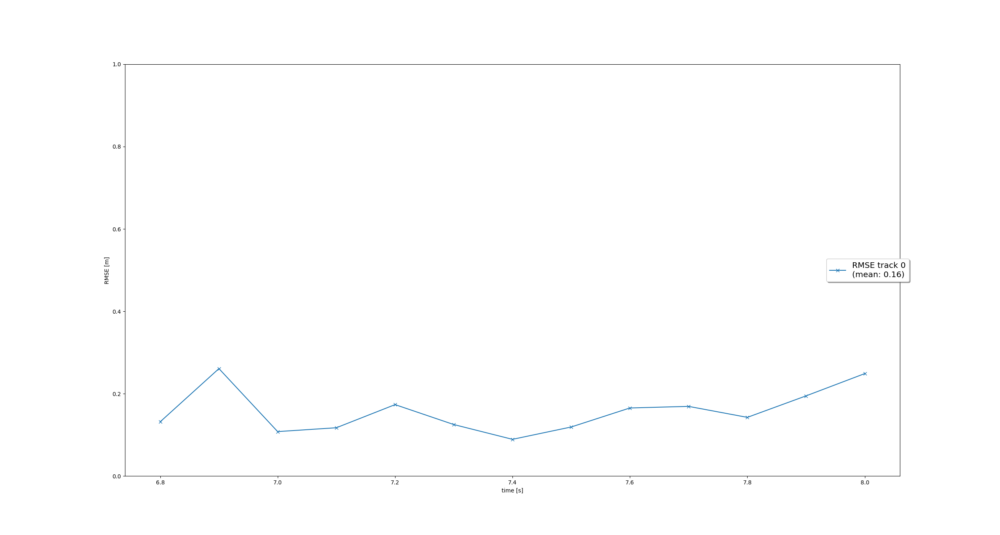

# Writeup: Mid-term Project - 3D Object Detection 
# 
This project is a midterm project in SDCN which is approached using a deep-learning approach is used to detect vehicles in LiDAR data based on a birds-eye view perspective of the 3D point-cloud. Also, a series of performance measures is used to evaluate the performance of the detection approach. The tasks in this part make up the mid-term project.

Detail information about file structure and installation instructions: [README.md](README.md)

This project consists of following tasks:
1. Compute Lidar Point-Cloud from Range Image
    1.1. Visualize range image channels (ID_S1_EX1)
        - Convert range image “range”, "intensity" channel to 8bit
        - Crop range image to +/- 90 deg. left and right of the forward-facing x-axis
        - Stack cropped range and intensity image vertically and visualize the result using OpenCV

    1.2. Visualize point-cloud (ID_S1_EX2)
        - Visualize the point-cloud using the open3d module
        - Find 6 examples of vehicles with varying degrees of visibility in the point-cloud
        - Try to identify vehicle features that appear stable in most of the inspected examples and describe them

2. Create Birds-Eye View from Lidar PCL
    2.1. Convert sensor coordinates to bev-map coordinates (ID_S2_EX1)
        - Convert coordinates in x,y [m] into x,y [pixel] based on width and height of the bev map

    2.2. Compute intensity layer of bev-map (ID_S2_EX2)
        - Assign lidar intensity values to the cells of the bird-eye view map
        - Adjust the intensity in such a way that objects of interest (e.g. vehicles) are clearly visible

    2.3. Compute height layer of bev-map (ID_S2_EX3)
        - Make use of the sorted and pruned point-cloud `lidar_pcl_top` from the previous task
        - Normalize the height in each BEV map pixel by the difference between max. and min. height
        - Fill the "height" channel of the BEV map with data from the point-cloud

3. Model-based Object Detection in BEV Image
    3.1. Add a second model from a GitHub repo (ID_S3_EX1)
        - In addition to Complex YOLO, extract the code for output decoding and post-processing from the GitHub repo.

    3.2. Extract 3D bounding boxes from model response (ID_S3_EX2)
        - Transform BEV coordinates in [pixels] into vehicle coordinates in [m]
        - Convert model output to expected bounding box format [class-id, x, y, z, h, w, l, yaw]

4. Performance Evaluation for Object Detection
    4.1 Compute intersection-over-union (IOU) between labels and detections (ID_S4_EX1)
        - For all pairings of ground-truth labels and detected objects, compute the degree of geometrical overlap
        - The function tools.compute_box_corners returns the four corners of a bounding box which can be used with the Polygon structure of the Shapely toolbox
        - Assign each detected object to a label only if the IOU exceeds a given threshold
        - In case of multiple matches, keep the object/label pair with max. IOU
        - Count all object/label-pairs and store them as “true positives”

    4.2 Compute false-negatives and false-positives (ID_S4_EX2)
        - Compute the number of false-negatives and false-positives based on the results from IOU and the number of ground-truth labels

    4.3 Compute precision and recall (ID_S4_EX3)
        - Compute “precision” over all evaluated frames using true-positives and false-positives
        - Compute “recall” over all evaluated frames using true-positives and false-negatives

## Step 1: Compute Lidar Point-Cloud from Range Image

### 1.1 Visualize range image channels
In the Waymo Open dataset, lidar data is stored as a range image. Therefore, this task is about extracting two of the data channels within the range image, which are "range" and "intensity", and convert the floating-point data to an 8-bit integer value range.

**Task preparations**
In file `loop_over_dataset.py`, set the attributes for code execution in the following way:

    data_filename = 'training_segment-1005081002024129653_5313_150_5333_150_with_camera_labels.tfrecord
    show_only_frames = [0, 1]
    exec_detection = []
    exec_tracking = []
    exec_visualization = ['show_range_image']

#### Result:

### 1.2 Visualize point-cloud
The goal of this task is to use the Open3D library to display the lidar point-cloud in a 3d viewer in order to develop a feel for the nature of lidar point-clouds.

**Task preparations**
In file loop_over_dataset.py, set the attributes for code execution in the following way:

    data_filename = 'training_segment-10963653239323173269_1924_000_1944_000_with_camera_labels.tfrecord'
    show_only_frames = [0, 200]
    exec_detection = []
    exec_tracking = []
    exec_visualization = ['show_pcl']

#### Result:

The lidar point cloud sparsely shows the chassis of cars as the identifiable feature. 
The below images are set in different angles to find further features which might be useful for object detection. 

## Step 2: Create Birds-Eye View from Lidar PCL

### 2.1 Convert sensor coordinates to bev-map coordinates (ID_S2_EX1)
The goal of this task is to perform the first step in creating a birds-eye view (BEV) perspective of the lidar point-cloud. Based on the (x,y)-coordinates in sensor space, you must compute the respective coordinates within the BEV coordinate space so that in subsequent tasks, the actual BEV map can be filled with lidar data from the point-cloud.

**Task preparations**
In file loop_over_dataset.py, set the attributes for code execution in the following way:

    data_filename = 'training_segment-1005081002024129653_5313_150_5333_150_with_camera_labels.tfrecord
    show_only_frames = [0, 1]
    exec_detection = ['bev_from_pcl']
    exec_tracking = []
    exec_visualization = []

#### Result

### 2.2 Compute intensity layer of bev-map (ID_S2_EX2)
Main goal of this task is to fill the "intensity" channel of the BEV map with data from the point-cloud. In order to do so, we would need to identify all points with the same (x,y)-coordinates within the BEV map and then assign the intensity value of the top-most lidar point to the respective BEV pixel. We could name the resulting list of points `lidar_pcl_top` as this will be re-used later. Also, we will need to normalize the resulting intensity image using percentiles, to make sure that the influence of outlier values are sufficiently mitigated and objects of interest are clearly separated from the background.

**Task preparations**
In file loop_over_dataset.py, set the attributes for code execution in the following way:

    data_filename = 'training_segment-1005081002024129653_5313_150_5333_150_with_camera_labels.tfrecord
    show_only_frames = [0, 1]
    exec_detection = ['bev_from_pcl']
    exec_tracking = []
    exec_visualization = []

#### Result

### 2.3 Compute height layer of bev-map (ID_S2_EX3)
In this task the goal was to fill the "height" channel of the BEV map with data from the point-cloud. One could make use of the sorted and pruned point-cloud `lidar_pcl_top` from the previous task and normalize the height in each BEV map pixel by the difference between max. and min. height which is defined in the `configs` structure.

**Task preparations**
In file loop_over_dataset.py, set the attributes for code execution in the following way:

    data_filename = 'training_segment-1005081002024129653_5313_150_5333_150_with_camera_labels.tfrecord
    show_only_frames = [0, 1]
    exec_data = ['pcl_from_rangeimage']
    exec_detection = ['bev_from_pcl']
    exec_tracking = []
    exec_visualization = []

#### Result

## Step 3: 3D Object Detection in BEV Image using pretrained model

### 3.1. Add a second model from a GitHub repo
The model-based detection of objects in lidar point-clouds using deep-learning is a heavily researched area with new approaches appearing in the literature and on GitHub every few weeks. On the website [Papers With Code](https://paperswithcode.com/) and on GitHub, several repositories with code for object detection can be found, such as [Complex-YOLO: Real-time 3D Object Detection on Point Clouds](https://paperswithcode.com/paper/complex-yolo-real-time-3d-object-detection-on) and [Super Fast and Accurate 3D Object Detection based on 3D LiDAR Point Clouds](https://github.com/maudzung/SFA3D).

The goal of this task is to illustrate how a new model can be integrated into an existing framework.

**Task preparations**
In file loop_over_dataset.py, set the attributes for code execution in the following way:

    data_filename = 'training_segment-1005081002024129653_5313_150_5333_150_with_camera_labels.tfrecord
    show_only_frames = [50, 51]
    exec_detection = ['bev_from_pcl', 'detect_objects']
    exec_tracking = []
    exec_visualization = ['show_objects_in_bev_labels_in_camera']
    configs_det = det.load_configs(model_name="fpn_resnet")

#### Result
Checkout the local variable "detections" in the function `detect_objects` --> from the [code](/student/objdet_detect.py)

### 3.2. Extract 3D bounding boxes from model response
As the model input is a three-channel BEV map, the detected objects will be returned with coordinates and properties in the BEV coordinate space. Therefore, before the detections can move along in the processing pipeline, we need to convert them into metric coordinates --> vehicle space, so that all detections have the format [1, x, y, z, h, w, l, yaw], where 1 denotes the class id for the object type vehicle.

**Task preparations**
In file loop_over_dataset.py, set the attributes for code execution in the following way:

    data_filename = 'training_segment-1005081002024129653_5313_150_5333_150_with_camera_labels.tfrecord
    show_only_frames = [50, 51]
    exec_detection = ['bev_from_pcl', 'detect_objects']
    exec_tracking = []
    exec_visualization = ['show_objects_in_bev_labels_in_camera']
    model = "fpn_resnet"
    sequence = "3"
    configs_det = det.load_configs(model_name=model)

#### Result

## Step 4: Performance Evaluation for Object Detection

### 4.1 Compute intersection-over-union between labels and detections
In this task we aksed to find pairings between ground-truth labels and detections, so that we can determine wether an object has been (a) missed (false negative), (b) successfully detected (true positive) or (c) has been falsely reported (false positive). Based on the labels within the Waymo Open Dataset, our task is to compute the geometrical overlap between the bounding boxes of labels and detected objects and determine the percentage of this overlap in relation to the area of the bounding boxes. A default method in the literature to arrive at this value is called intersection over union.

**Task preparations**
In file loop_over_dataset.py, set the attributes for code execution in the following way:

    data_filename = 'training_segment-1005081002024129653_5313_150_5333_150_with_camera_labels.tfrecord
    show_only_frames = [50, 51]
    exec_detection = ['bev_from_pcl', 'detect_objects', 'validate_object_labels', 'measure_detection_performance']
    exec_tracking = []
    exec_visualization = ['show_detection_performance']
    model = "darknet"
    sequence = "1"
    configs_det = det.load_configs(model_name=model)

#### Result
checkout values of variables ---->  `ious` and `center_devs` from the [code](/student/objdet_eval.py)

### 4.2 Compute false-negatives and false-positives
Based on the pairings between gt labels and detected objects, the goal of this task is to determine the number of false positives and false negatives for the current frame. After frames have been processed, an overall performance measure would be computed based on the results.

#### Result
checkout values of variables  ---> `det_performance` from the [code](/student/objdet_eval.py)

### 4.3 Compute precision and recall
After processing all the frames of a sequence, the performance of the object detection algorithm shall now be evaluated. To do so in a meaningful way, the two standard measures "precision" and "recall" will be used, which are based on the accumulated number of positives and negatives from all frames.

**Task preparations**
In file loop_over_dataset.py, set the attributes for code execution in the following way:

    data_filename = 'training_segment-1005081002024129653_5313_150_5333_150_with_camera_labels.tfrecord
    show_only_frames = [50, 150]
    exec_detection = ['bev_from_pcl', 'detect_objects', 'validate_object_labels', 'measure_detection_performance']
    exec_tracking = []
    exec_visualization = ['show_detection_performance']
    model = "darknet"
    sequence = "1"
    configs_det = det.load_configs(model_name=model)

#### Result

`precision = 0.9506578947368421, recall = 0.9444444444444444`

To make sure that the code produces plausbile results, the flag `configs_det.use_labels_as_objects` should be set to `True` in a second run.

